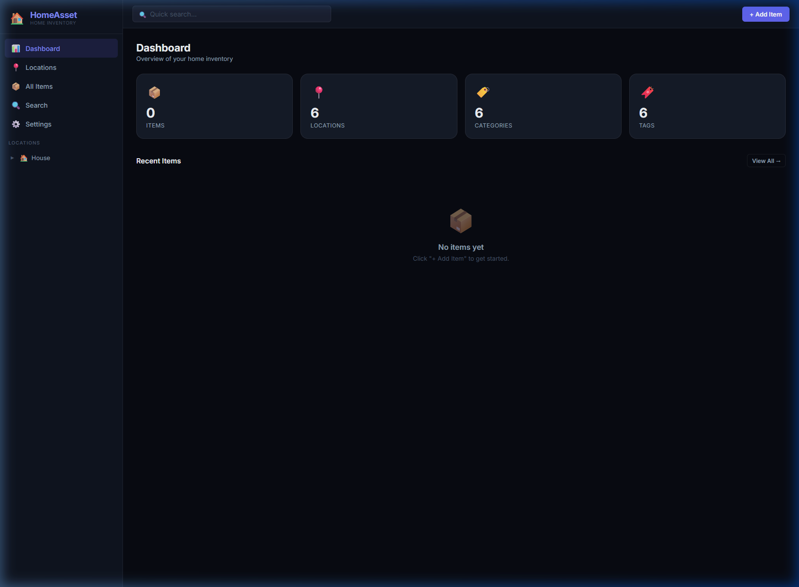
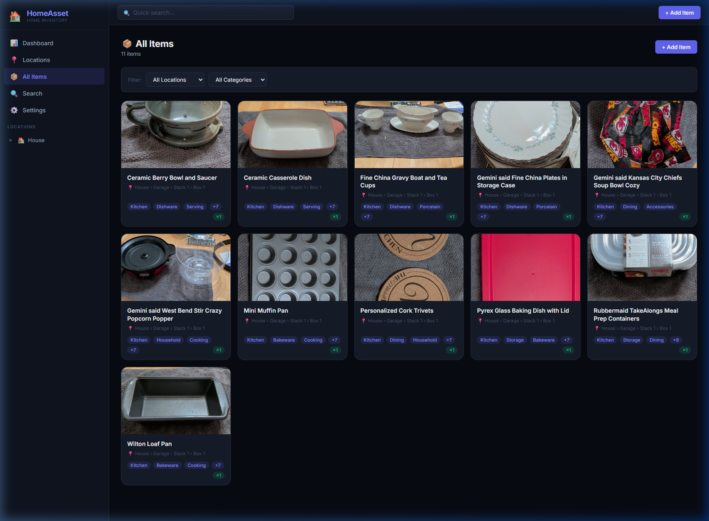
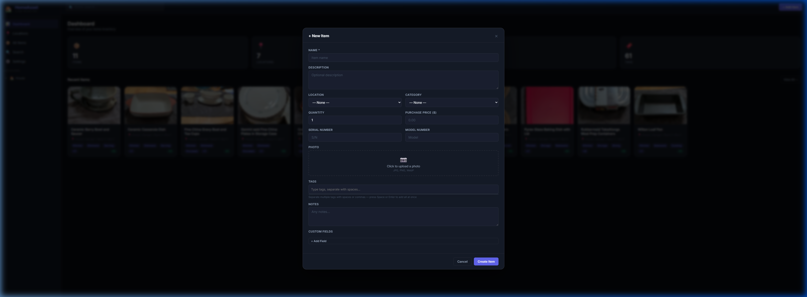
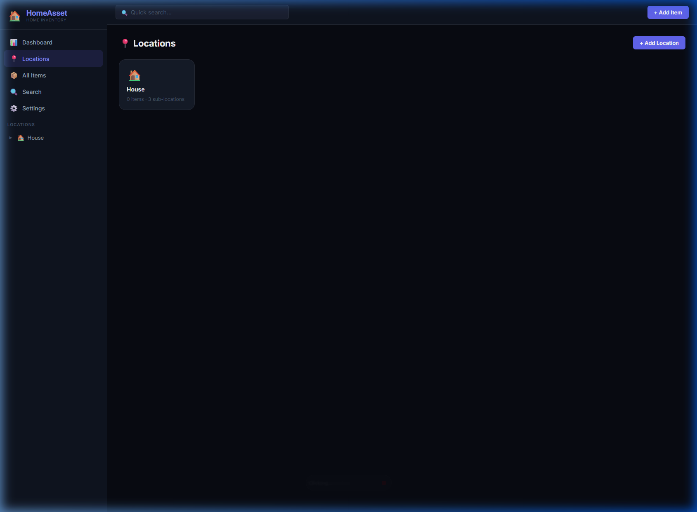
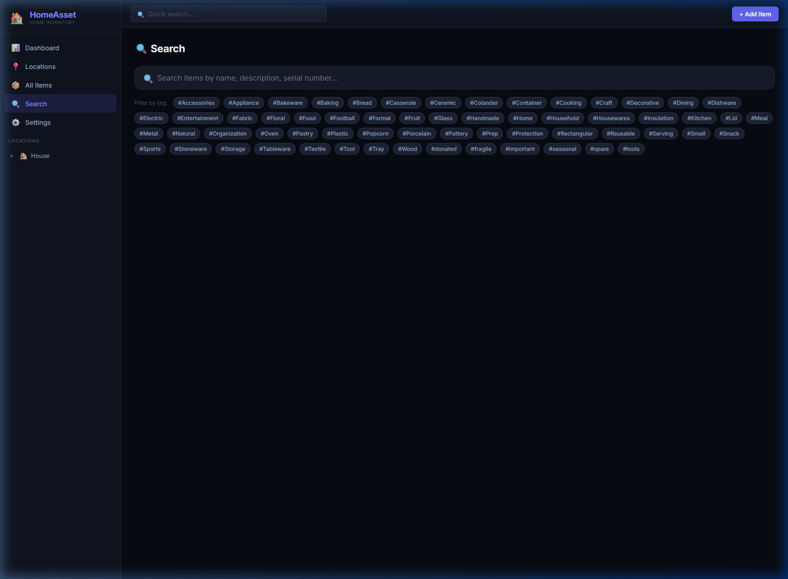
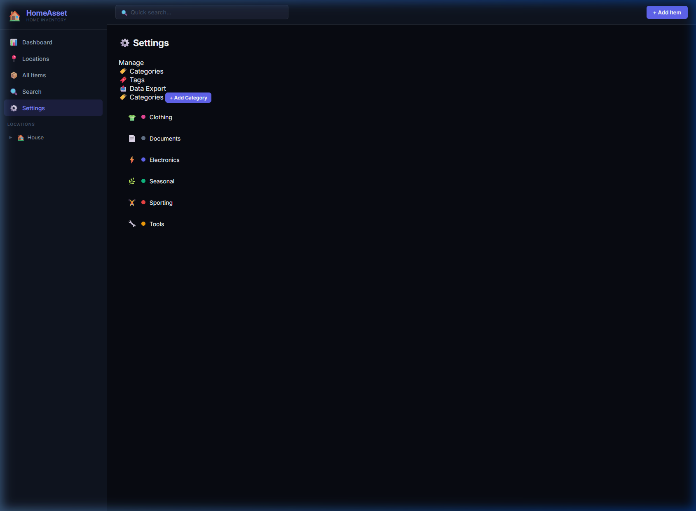
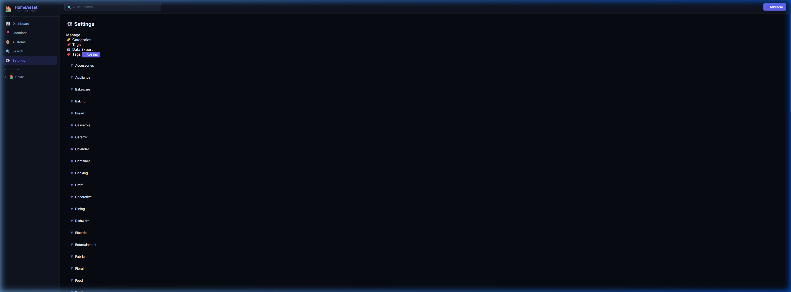
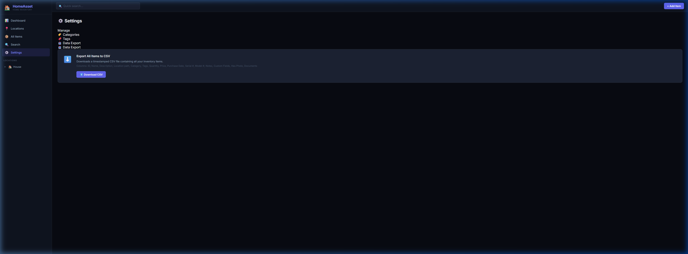

<div align="center">

# 🏠 HomeAsset

**Self-hosted home inventory management — organized, searchable, and always available on your local network.**

[](#quick-start)
[](https://www.python.org/)
[](https://fastapi.tiangolo.com/)
[](https://www.sqlite.org/)
[](LICENSE)

</div>

---

HomeAsset is an open-source inventory and organization system built for home users. Track physical assets, organize storage locations, attach photos and documents, and export everything to CSV — all running on your own hardware with zero cloud dependency and no login required.

## ✨ Features

### 📍 Hierarchical Locations
Build a nested tree of storage locations — `House → Garage → Shelf A → Bin 3`. No depth limit. Each location shows item counts and supports its own icon and color.

### 📦 Rich Item Management
Every item supports:
- **Name, Description, Notes**
- **Location** (chose from your full location tree)
- **Category** with icon and color coding
- **Tags** — add multiple tags at once by typing space-separated words
- **Photo upload** — taken directly during item creation or editing
- **Document attachments** — PDFs, manuals, receipts
- **Custom Fields** — arbitrary key/value pairs (e.g. `Color: Black`, `Size: 18gal`)
- **Quantity, Purchase Price, Purchase Date, Serial Number, Model Number**

### 🔍 Powerful Search
Full-text search across name, description, serial number, model number, and notes. Filter simultaneously by tags, location, and category.

### ⚙️ Settings Panel
Two-panel settings interface to manage Categories, Tags, and Data Export — all without a page reload.

### 📤 CSV Export
One-click export of your entire inventory to a timestamped CSV, including the full location path (`House > Garage > Shelf A`), all tags, custom fields, and more.

### 🔒 No Authentication Required
Designed for trusted home networks — open it in any browser on your LAN, no accounts needed.

### 💾 Portable & Persistent
All data stored in a single SQLite file (`/data/homeasset.db`). Backup by copying one file. Data persists across container recreations via a Docker volume.

---

## 📸 Screenshots

### Dashboard

*At-a-glance inventory stats: total items, locations, categories, and tags. Recent items shown below.*

### All Items

*Grid view of all items with photo thumbnails, location, category badge, and tag chips. Filter by location or category.*

### Add Item

*Full-featured item creation: photo upload, multi-tag input (space-separated), location picker, custom fields, and more — all in one modal.*

### Locations

*Visual location cards with item counts. Drill into any location to see sub-locations and their items.*

### Search

*Full-text search with one-click tag filters. Results update instantly as you type.*

### Settings — Categories

*Two-panel settings layout. Manage categories (icon + color) from the left-nav panel.*

### Settings — Tags

*Quick tag management. Delete any tag — it's automatically removed from all items.*

### Settings — Data Export

*One-click CSV export of the full inventory with all metadata.*

---

## 🚀 Quick Start

### Prerequisites
- [Docker](https://docs.docker.com/get-docker/) + [Docker Compose](https://docs.docker.com/compose/install/)

### 1. Clone the repository
```bash
git clone https://github.com/legendary034/HomeAsset.git
cd HomeAsset
```

### 2. Start the container
```bash
docker compose up -d
```

### 3. Open in your browser
```
http://localhost:7745
```

Or replace `localhost` with your server's IP to access from any device on your network.

> **First boot:** HomeAsset automatically seeds the database with example locations, categories, and tags so you have something to work with immediately.

---

## ⚙️ Configuration

### `docker-compose.yml`
```yaml
services:
  homeasset:
    build: .
    ports:
      - "7745:7745"
    volumes:
      - ./data:/data
    restart: unless-stopped
```

| Volume | Purpose |
|---|---|
| `./data:/data` | Persists the SQLite database, uploaded photos, and attached documents |

**To change the port**, update `7745:7745` to `<your-port>:7745`.

### Backup
Your entire dataset lives in `./data/`. Copy this folder to back everything up:
```bash
cp -r ./data ./data_backup_$(date +%Y%m%d)
```

### Reset / Fresh Start
To wipe all data and start over:
```bash
docker compose down
rm -rf ./data
docker compose up -d
```

---

## 🏗️ Architecture

| Layer | Technology |
|---|---|
| **Backend** | Python 3.11, FastAPI, SQLAlchemy (ORM), Uvicorn |
| **Database** | SQLite (embedded, no setup required) |
| **Frontend** | Vanilla HTML/CSS/JavaScript (SPA, no framework) |
| **Fonts** | Google Fonts — Inter |
| **Container** | Docker (single container, ~200MB image) |

### Project Structure
```
HomeAsset/
├── app/
│   ├── main.py              # FastAPI app, route ordering, seed data
│   ├── models.py            # SQLAlchemy ORM models
│   ├── schemas.py           # Pydantic request/response schemas
│   ├── database.py          # DB engine and session factory
│   ├── routers/
│   │   ├── items.py         # CRUD + image/doc upload + CSV export
│   │   ├── locations.py     # Recursive location tree
│   │   ├── categories.py
│   │   ├── tags.py
│   │   └── search.py
│   └── static/
│       ├── index.html
│       ├── css/style.css
│       └── js/
│           ├── app.js       # App shell, routing, shared state
│           └── views.js     # All page and modal renderers
├── data/                    # Persistent volume (gitignored)
├── Dockerfile
├── docker-compose.yml
└── requirements.txt
```

---

## 🗺️ Roadmap

- [ ] Item duplication (clone an item to a new location)
- [ ] Bulk import via CSV upload
- [ ] QR code labels for items and locations
- [ ] Low-stock quantity alerts
- [ ] Item history / audit log

---

## 🤝 Contributing

Pull requests are welcome! For major changes, please open an issue first to discuss what you'd like to change.

---

## 📄 License

[MIT](LICENSE) — free to use, modify, and self-host.
